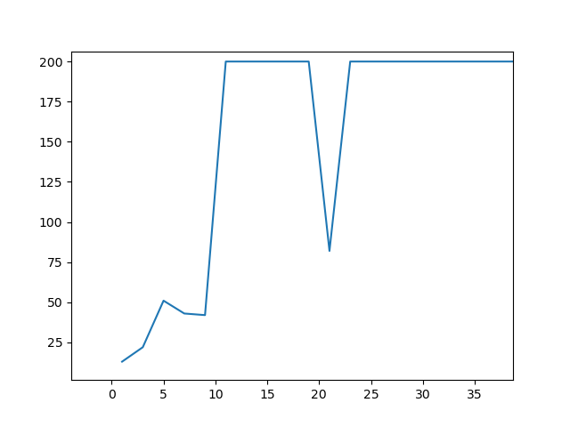

# Reinforcement Learning

This repo serves as a collection of different codes created on various reinforcement learning
methods and problems with OpenAI Gym games.

### Cartpole

Cartpole was trained with a neural network with the following architecture:

1. Fully connected layer with size = input_size (state_space)
2. Relu activation layer
3. Fully connected layer with 24 neurons
4. Relu activation layer
5. Fully connected layer with 24 neurons
6. Linear activation in output layer

The network was able of solving the cartpole problem in around 35 episodes as shown below

